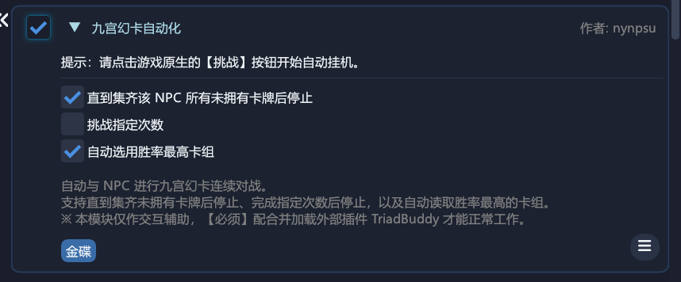
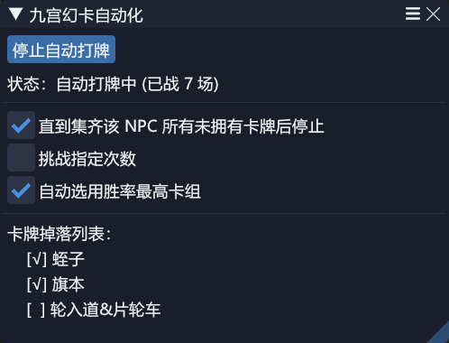
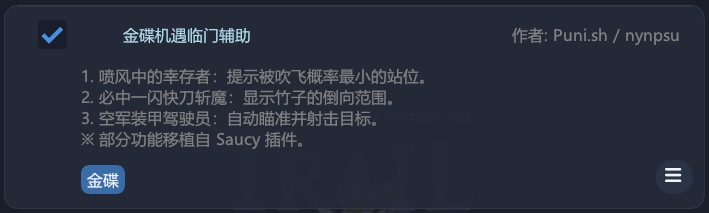
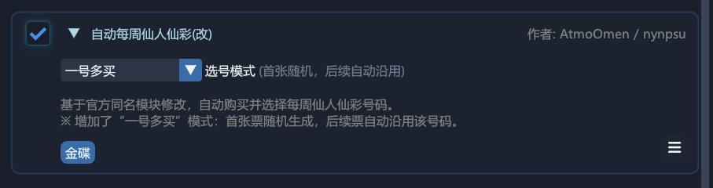
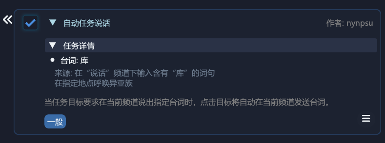
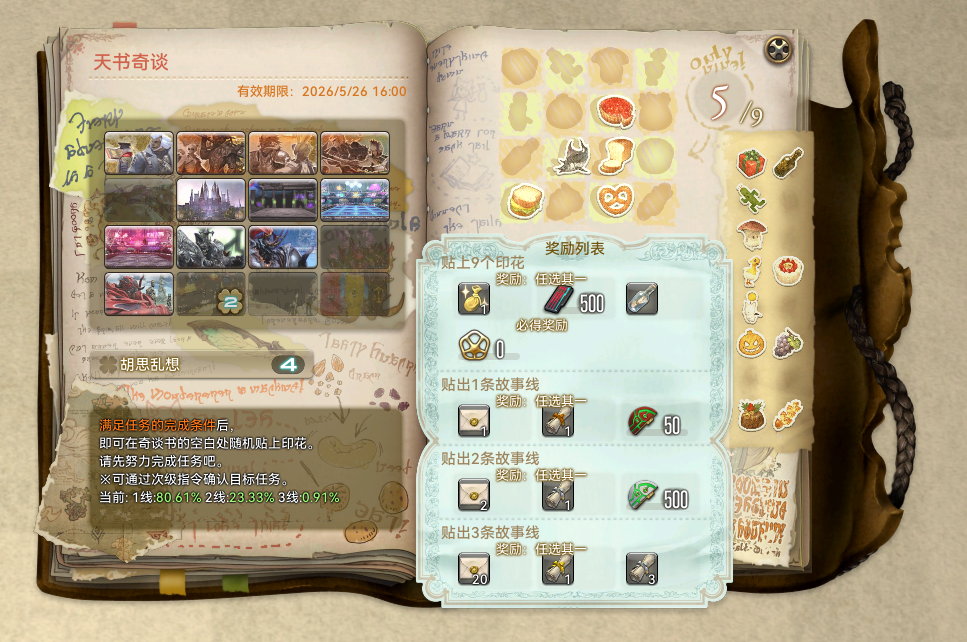
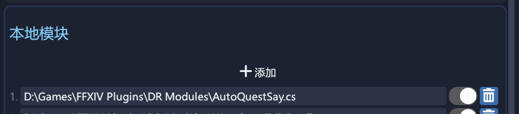

# 🛠️ DailyRoutines Local Modules

> 个人自用的 DailyRoutines (DR) 本地增强与定制化模块备份。

---

## 🎰 金碟游乐场 (Gold Saucer)

### 1. 九宫幻卡自动化 (`AutoTripleTriad.cs`)
自动与 NPC 进行九宫幻卡对战，加速卡牌收集流程。
- **对战目标配置**：支持对战指定次数，或直到收集齐该 NPC 身上所有未拥有的幻卡为止。
- **智能策略选择**：支持自动读取并应用当前胜率最高的卡组。
- ⚠️ *注意：本模块仅作交互辅助，必须配合并开启外部插件 **TriadBuddy** 才能正常工作。*

  
  &nbsp;&nbsp;&nbsp;&nbsp;
  

 

### 2. 金碟机遇临门辅助 (`GoldSaucerGATEsHelper.cs`)
金碟游乐场随机活动（GATE）的辅助，部分功能移植自 Saucy 插件。
- **喷风中的幸存者**：实时计算并提示被吹飞概率最小的“安全站位”。
- **必中一闪快刀斩魔**：高亮标示竹子的倒向与攻击波及范围。
- **空军装甲驾驶员**：自动瞄准并射击目标，避开炸弹。

  
    
  
  &nbsp;&nbsp;
  

 

### 3. 自动每周仙人仙彩(改) (`AutoJumboCactpotCustom.cs`)
自动购买每周仙人仙彩，基于官方原版进行增强。
- **一号多买模式**：首张仙彩票随机生成号码，后续购买的票自动沿用该号码。

  

---

## 📅 日常与周常 (Daily & Weekly)

### 4. 自动雇员作业(改) (`AutoRetainerWorkCustom.cs`)
自动收取雇员探索并重新派遣，提升日常收派遣的流畅度。
- **智能对话跳过**：在执行收发雇员期间，系统将自动开启“跳过对话”模块，确保派遣过程的流畅性。
- **超低物价保护**：自动改价触发“低于最小值”意外时，自动倒查并过滤倒数二、三位的异常低价，防止因个例超低价导致改价异常。

  

 

### 5. 自动任务说话 (`AutoQuestSay.cs`)
自动处理任务交互中需要玩家发送特定频道消息（如 `/say 任务词句`）的环节。
- **自动台词发送**：点击对应的任务目标时，若检测到属于这类任务，本模块会自动发送匹配的文本内容。

  
  &nbsp;&nbsp;&nbsp;&nbsp;
  

 

### 6. 天书连线概率 (`WondrousTailsPredictor.cs`)
在库洛的奇谈书界面提供连线概率计算辅助。
- **多色概率提醒**：实时显示 1/2/3 线连线率，并通过多色高亮（0%置灰、100%或优于洗牌期望）辅助决策。

  
    
  

---

## 🎨 界面示例

在 DailyRoutines 中加载后的本地模块列表界面展示：

  

