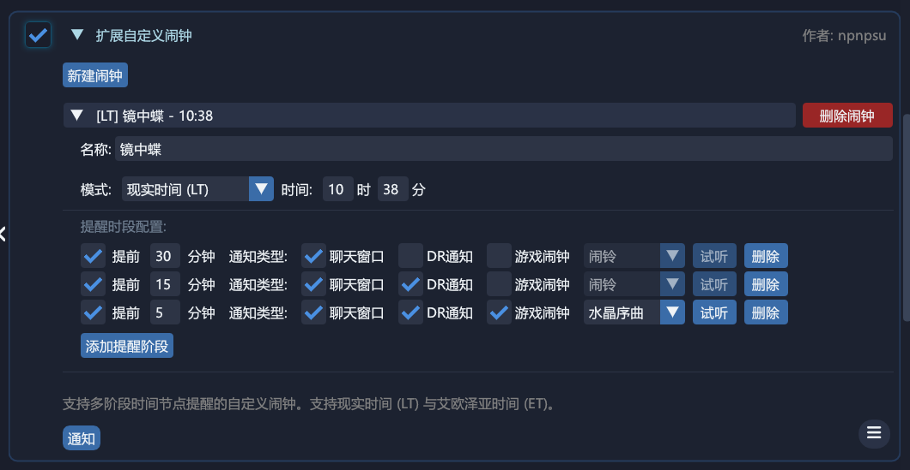

# DailyRoutines Local Modules

个人自用的 DailyRoutines (DR) 本地模块备份。

## 模块分类与列表

### 金碟游乐场

#### 1. 九宫幻卡自动化 (AutoTripleTriad.cs)
自动与 NPC 进行九宫幻卡连续对战。 
支持直到集齐未拥有卡牌后停止、完成指定次数后停止，以及自动读取胜率最高的卡组。 
※ 本模块仅作交互辅助，【必须】配合并加载外部插件 TriadBuddy 才能正常工作。

#### 2. 金碟机遇临门辅助 (GoldSaucerGATEsHelper.cs)
1. 喷风中的幸存者：提示被吹飞概率最小的站位。 
2. 必中一闪快刀斩魔：显示竹子的倒向范围。 
※ 功能移植自 Saucy 插件。

 

 
<!--  -->

#### 3. 自动每周仙人仙彩(改) (AutoJumboCactpotCustom.cs)
基于官方同名模块修改，自动购买并选择每周仙人仙彩号码。 
※ 增加了“一号多买”模式：首张票随机生成，后续票自动沿用该号码。

---

### 日常与周常

#### 4. 自动雇员作业(改) (AutoRetainerWorkCustom.cs)
基于官方同名模块修改，自动收取并重新派遣雇员。 
※ 增加了执行期间会自动开启“跳过对话”模块的功能。

#### 5. 自动任务说话 (AutoQuestSay.cs)
点击任务目标自动发送指定台词。

 

#### 6. 天书连线概率 (WondrousTailsPredictor.cs)
在天书界面显示连线概率及重排期望。

 

#### 7. 自定义闹钟 (CustomAlarms.cs)
支持多阶段时间节点提醒的自定义闹钟。支持现实时间 (LT) 与艾欧泽亚时间 (ET)。

---

### 界面示例

